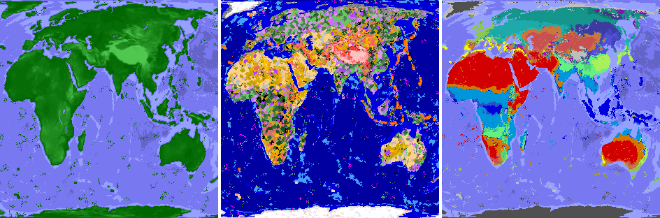

## TFC: Real World

### What this mod does

**TFC: Real World** generates a world that looks and feels like a believable version of our own planet – a map of Earth filled with all the original **TerraFirmaCraft** content and progression.  
Instead of random continents and climates, the world is shaped using real‑world datasets for continents, elevation, rivers, biomes, and climate zones.  
You still play full TerraFirmaCraft – the same rocks, ores, tools, tech tree, seasons, food system and survival mechanics – but now all of that lives on a large‑scale layout of land, oceans, mountains and climate inspired by Earth.

The goal of the mod is to give you a **recognizable, exploration‑focused TFC world**:

- **Sail across familiar oceans** and trace coastlines that resemble real Earth.
- **Climb mountain ranges** where major real‑world ranges would be, and dive into deep ocean basins.
- **Travel through realistic climate belts and biomes**, from equatorial rainforests to deserts, steppes, temperate forests and polar regions.

**Important:** the mod does **not** change vanilla TFC mechanics, items or progression and does **not** override TFC's core worldgen systems.  
It only adds extra _real‑world rules_ that tell TFC _where_ to place land, heights, climate and biomes, using external map data.

---

### Features and changes in detail

- **Real‑world continent layout (from map)**

  - Continents and oceans can be sampled from a PNG map (`continent.png`) instead of pure noise.
  - This produces large‑scale landmasses and ocean basins that resemble Earth's distribution while still going through TFC's normal region and biome pipeline.
  - Optionally supports finite or looping continents, controlled via configuration.

- **Elevation and ocean depth from real‑world altitude data**

  - Base land height and ocean depth can be taken from an altitude map (`altitude.png`).
  - Brightness values above sea level are mapped to TFC's base land height range; darker underwater pixels are mapped to base ocean depth.
  - This gives you realistic mountain chains, plateaus, continental shelves and deep oceans, without changing TFC's block types or strata logic.

- **Hotspot‑based volcanism tied to real maps**

  - Volcanic hotspot intensity and age can be driven by a dedicated grayscale map (`hotspots.png`).
  - The map encodes different hotspot activity levels (ancient, extinct, dormant, active), so volcanic features appear in locations consistent with real tectonic settings.
  - The underlying TFC volcano mechanics are left intact – only the spatial distribution is constrained by the map.

- **Köppen climate map integration**

  - A Köppen climate classification PNG (`koppen.png`) is used to control the climate parameters that TFC already uses: temperature, rainfall and rainfall variance.
  - Each pixel of the map is interpreted as a specific Köppen class (AF, BWh, Dfb, etc.) and converted into plausible parameter ranges for that climate.
  - This results in **realistic climate belts**: humid tropics around the equator, arid subtropics, temperate zones, continental interiors and polar regions, all still processed through TFC's climate and season systems.

- **Distance‑aware regional annotations**

  - The mod adds helpers that annotate each TFC region with information such as distance to the nearest ocean, distance to the western coastline, and more.
  - These annotations are used only to refine world generation decisions (for example, shaping rainfall patterns or helping rivers and coasts feel more natural) and do not introduce new gameplay mechanics.

- **Non‑invasive worldgen integration**

  - Core TFC classes like `RegionGenerator` and `Settings` are extended via mixins only to:
    - Replace continent / altitude / hotspot / climate **noise sources** with map‑driven ones, when the corresponding options are enabled.
    - Override numeric configuration values (like continentalness, spawn location, temperature and rainfall scale) from the mod's config file.
  - No new blocks, items, tools, tech tiers, mobs or GUIs are added. Existing TFC content is used as‑is, just guided by real‑world geography.

- **Optional biome volcano tweaks**

  - A configuration option can remove volcanic features from the TFC `canyons` and `doline_canyons` biomes.
  - When enabled, those biomes use their non‑volcanic surface builders and height noise, making them feel more like pure erosion canyons instead of volcanic landscapes.

- **Dynamic resource and data packs**
  - On startup, the mod registers dynamic resource and data packs that expose its maps and data to Minecraft/TFC without requiring you to manage external packs manually.
  - Default map PNGs are bundled inside the mod and **automatically copied** into the game's directory if missing, so you can easily inspect or replace them.

In short, **TFC: Real World keeps TerraFirmaCraft's gameplay complete and untouched**, and only changes **where** and **how** the existing systems are applied, using real‑world‑inspired map data.

---

### Configuration and customization

All configuration is stored in the file:

- `config/tfc_real_world/common.toml`

The options are grouped similarly to the internal config structure:

- **World generation settings (`world_generation`)**

  - **Continentalness, finite continents, grass density** – mirror TFC's own world settings, but can be overridden here without editing TFC's original JSONs.
  - **Flat bedrock** – toggle whether bedrock should be flat.
  - **Spawn center (X/Z) and spawn distance** – control where the world spawn region is centered and how far from the center players can appear.
  - **Temperature / rainfall scale** – set the horizontal scale (in blocks) over which temperature and rainfall change, keeping behavior consistent with TFC but adjusted to match your world size.

- **Generation modes (`generation_modes`)**

  - **Vertical world scale / horizontal world scale** – define the effective diameter of your world in blocks. This affects distances between poles, the _Globe Trotter_ advancement, and how real‑world maps are stretched over the world.
  - **`continent_from_map`, `altitude_from_map`, `hotspots_from_map`, `koppen_from_map`** – main toggles that decide whether each system uses **real‑world maps** or **pure TFC procedural noise**.
    - When these are **false**, the corresponding part of worldgen behaves exactly like stock TerraFirmaCraft.
    - When **true** (the default for most of them), the same TFC systems are simply driven by real‑world PNG maps.
  - **Pole offset and pole looping** – fine‑tune how the poles are positioned and whether they wrap around, useful for matching climate belts to your preferred exploration pattern.

- **Biome modifications (`biome_modifications`)**

  - **`canyons_not_volcanic`** – when enabled, removes volcanic behavior from `canyons` and `doline_canyons` biomes while keeping everything else unchanged.

- **Map files and customization**
  - All map PNGs used by the mod are stored in:
    - `config/tfc_real_world/maps/altitude.png`
    - `config/tfc_real_world/maps/continent.png`
    - `config/tfc_real_world/maps/hotspots.png`
    - `config/tfc_real_world/maps/koppen.png`
  - On first run, the mod copies its built‑in default maps into this directory. Advanced users can back them up and replace them with their own maps (keeping names and basic format compatible) to experiment with alternative Earth reconstructions or fantasy worlds, while still using TerraFirmaCraft's mechanics.
